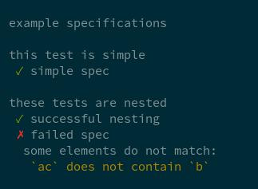

## Intro
_kallikrein_ is a test framework inspired by [specs2], focused on functional
purity and composability.

At this time, only basic structure is implemented, more to come soon.

## Install
```
pip install kallikrein
```

## Write
Spec classes need only define a docstring containing interpolation expressions
that specify which of the class' methods are specs:

```python
from kallikrein import k
from kallikrein.matchers import contain, greater_equal, forall
from amino import List

class ASpec:
    '''example specifications

    this test is simple
    simple spec $simple

    these tests are nested
    successful nesting $nested
    failed spec $failure '''

    def setup(self) -> None:
        self.a = 3

    def simple(self) -> MatchResult:
        return k(3).must(greater_equal(self.a))

    def nested(self) -> MatchResult:
        return k(List(1, 2, 3)).must(contain(greater_equal(self.a)))

    def failure(self) -> MatchResult:
        return k(List('abc', 'abc', 'ac')).must(forall(contain('b')))
```

There is no magic involved, the strings from the docstring are simply used with
`getattr`.

The expectations aren't evaluated in-place, but after having been returned to
the spec runner. There is an alternative, impure version called `unsafe_k` that
raises an exception.

## Run
```
klk mod.path.to.ASpec
```
The output looks like this:



## Extend
`must` expects a subclass of `Matcher` for its argument which can be
customized easily. The matcher should calculate a `MatchResult` containing
information about the match.

This is the implementation of `contain` for reference:

```python
class Contain(Matcher):

    def match(self, exp):
        success = '`{}` contains `{}`'.format(exp, self.target)
        failure = '`{}` does not contain `{}`'.format(exp, self.target)
        return SimpleMatchResult(self.target in exp, success, failure)

    def match_nested(self, exp):
        nested = exp.map(self.target)
        return ExistsMatchResult(str(self), exp, nested)

contain = matcher(Contain)
```
`SimpleMatchResult` is constructed with a boolean, indicating success, and two
strings that describe the success and failure.

`ExistsMatchResult` is a little more complex; it receives the list of nested
matche results (one for each list element) and creates a detailed error
message.

The `target` attribute of `Matcher` contains either a nested `Matcher` or a
strict value, like `2` for `contain(2)`.

[specs2]: https://github.com/etorreborre/specs2
